# Word Embeddings
## Course Information
- Video: https://www.youtube.com/watch?v=lVD07zRngNg
- Slide: http://www.phontron.com/class/nn4nlp2019/assets/slides/nn4nlp-03-wordemb.pdf
- Materials: [Chapter 10 in Neural Network Methods for Natural Language Processing by Yoav Goldberg]

## Motivation
Q: What do we want to know about words?

- 1: Are they the same part of speech? 
- 2: Do they have the same conjugation (词性变化)?
- 3: Do these two words mean the same thing?
- 4: Do they have some semantic relation (is-a, part-of, went-to-school-at)?

A:  Possible solutions

- 1: **Knowledge-based Representation (Distributional)**: WordNet (manual). WordNet is a large database of words including parts of speech, semantic relations.)
- 2: **Corpus-based Representation (Non-Distributional)**: 
    - Atomic symbols (*one-hot* representation, local): difficult to compute the similarity (i.e. comparing "car" and "motorcycle")
    - A continuous vector representation of words (distributed).

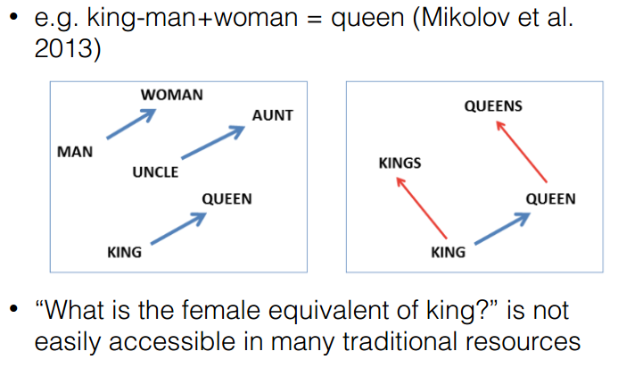 

**Concepts**:
- **Word Embeddings**: 其实就是一个映射，将单词从原先所属的空间映射到新的多维空间中，也就是把原先词所在空间嵌入到一个新的空间中去。
- *Distributional*: words are similar if they appear in similar contexts, non-distributional created from lexical resources.
- *Distributed*: represented by a vector of values, each representing activations (features of syntax and semantics), local ones are represented by a discrete symbol.

## Basic Methods
- **Count-based Methods**: create a word-context count matrix
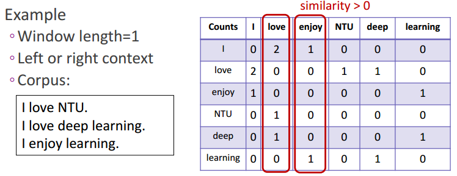 

*Problems*:
	- matrix size increases with vocab;
	- high dimensional, sparsity;
*Solution*: get the low dimensional word vector by using *SVD* of co-occurrence matrix.

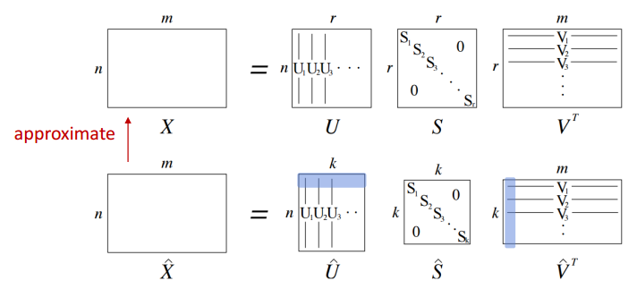 

*Problems*:
	- computationally expensive;
	- difficult to add new words;
*Solution*: directly learn the low-dimensional word vectors.

- **Prediction-based Methods**: try to *predict* the words within a NN. Word embeddings are the byproduct.

-**Word2Vec** (Mikolov et al, NIPS 2013): **Skip-Gram** and **CBOW**
	-*Skip-Gram* vs *CBOW*: **Skip-Gram** predicts surrounding words within a window of each word, while **CBOW** predicts the target word given the surrounding words.
{width="700px" height="400px" align="center"}
	
-**Skip-Gram**:
{width="700px" height="400px" align="center"}
	- Model Architecture
	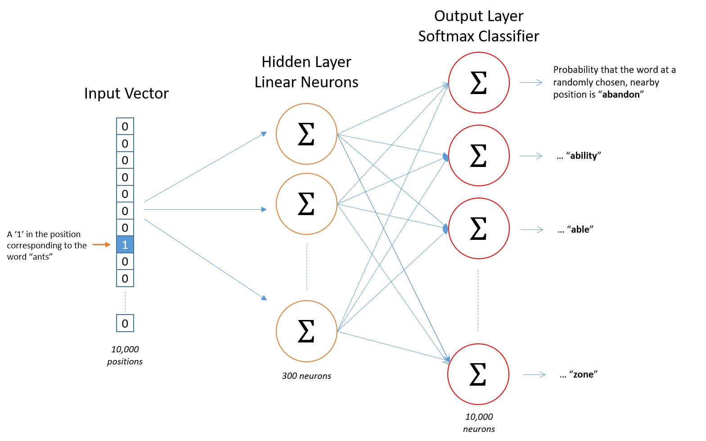{width="700px" height="400px" align="center"}
	- Hidden Layer Weight Matrix (word embedding)
	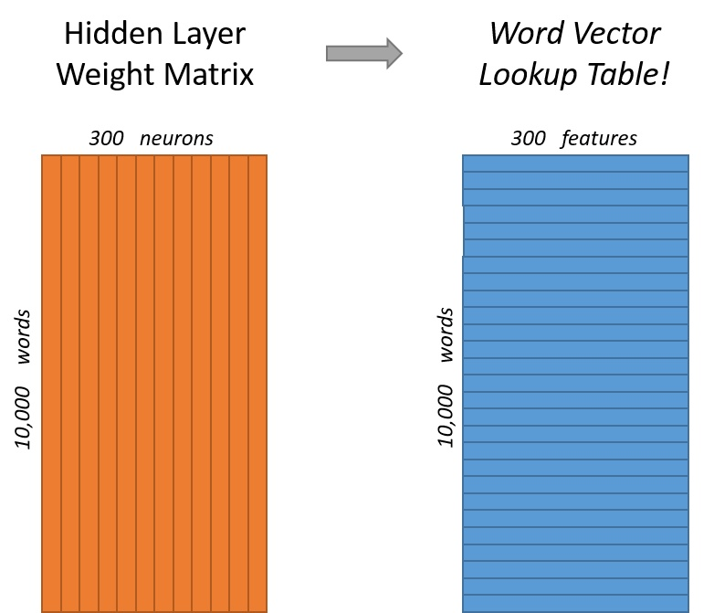{width="550px" height="400px" align="center"}
	- Output Layer
	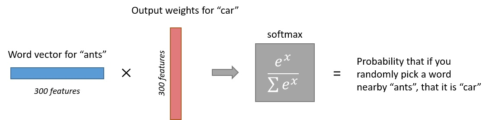{width="600px" height="150px" align="center"}
	- Hierarchical Softmax
	- Negative Sampling

- **Glove** (Pennington et al., EMNLP 2014)

- **Word  Vector Evaluation**

## Related SoTA Work
- [CoVe(NIPS2017)] (Contextualized Word Vectors)
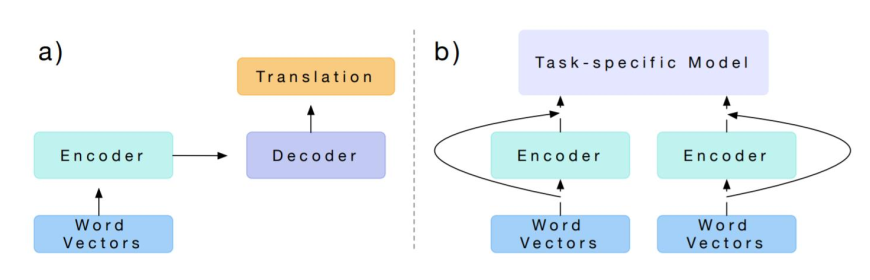{width="600px" height="250px" align="center"}

- [ELMo (NAACL2018)](https://aclweb.org/anthology/N18-1202) (**E**mbeddings from **L**anguage **Mo**dels)
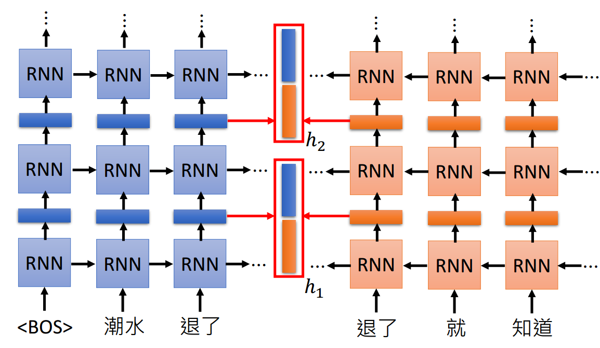{width="600px" height="250px" align="center"}
        
- [BERT(NAACL2019)](https://arxiv.org/pdf/1810.04805.pdf) (**B**idirectional **E**ncoder **R**epresentations from **T**ransformers)
    - [Transformer](https://papers.nips.cc/paper/7181-attention-is-all-you-need.pdf)3
    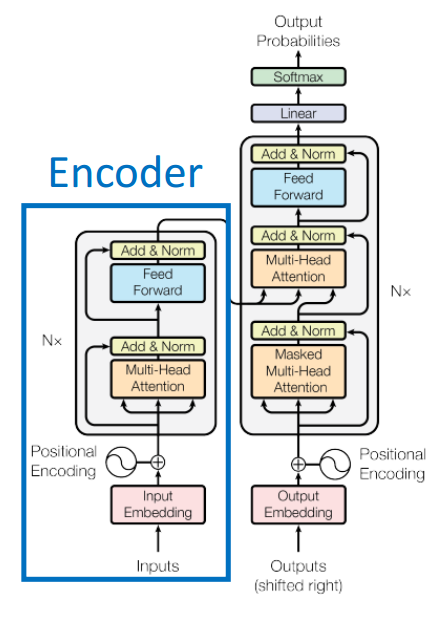{width="300px" height="500px" align="center"}
    - Masked LM
        - Masked some words out in a sentence and predict it
        - Trick
            - Not all words with [MASK] will be merely represented by [MASK]. Instead, 10 percent of words [MASK] will be shown in their original form, like 'dog' for 'dog', 20 percent of them will be replaced by random word, i.e. 'apple' for 'dog' and the others remain [MASK]. 
            - This training tricks mitigate the **unintended bias** resulting from special mark. That is to say, similar tricks can be reused if we have to introduce special mark in the model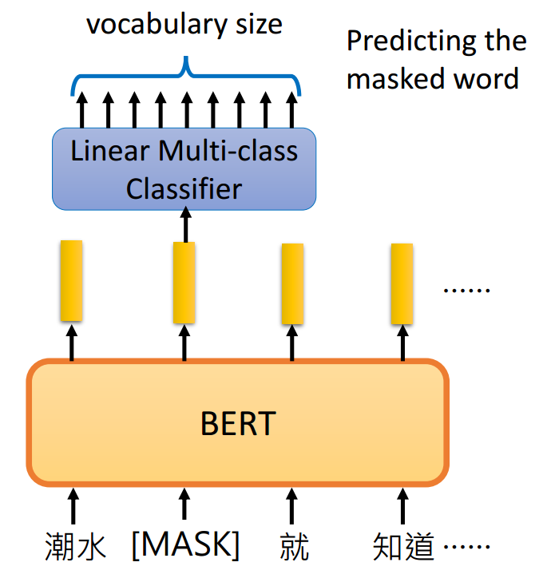{width="400px" height="400px" align="center"}
    - Next sentence prediction
        - Text-pair classification, which determines whether sentence A is followed by sentence B, semantically or logically
        - When choosing the sentences A and B for each pretraining example, 50% of the time B is the actual next sentence that follows A, and 50% of the time it is a random sentence from the corpus.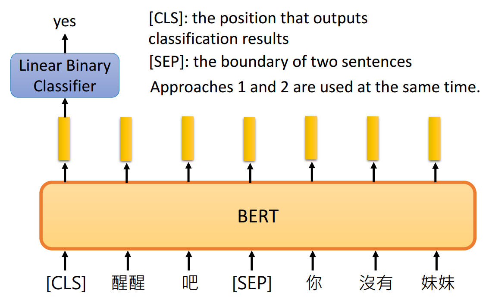{width="550px" height="400px" align="center"}
    - Model Details
        - WordPiece embeddings
        - learned positional embeddings
        - Stacked Tranformer encoder
        - Trained with masked LM and next sentence prediction
    - What does BERT learn?
     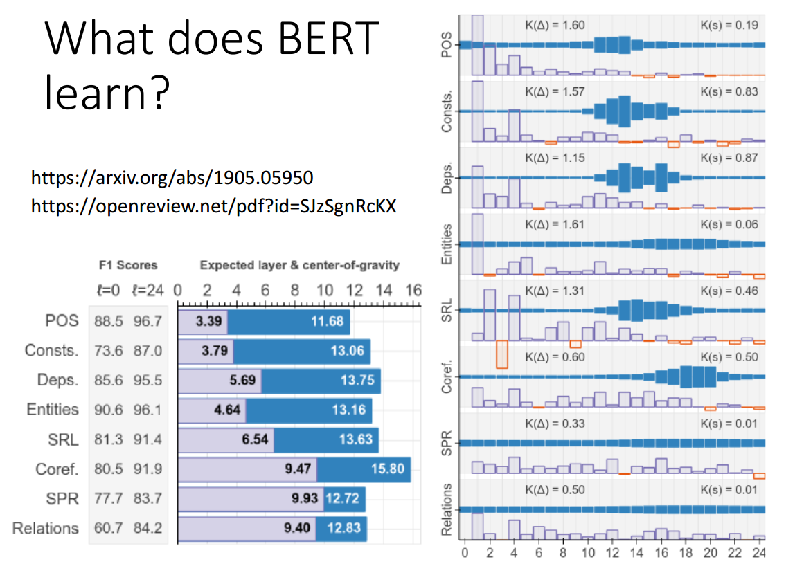{width="600px" height="400px" align="center"}
        
 - [GPT] (Generative Pre-Training)
 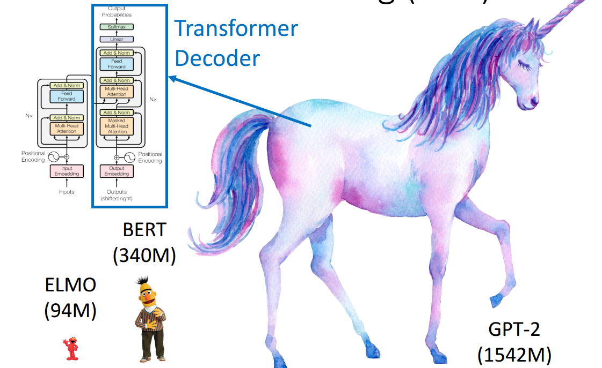{width="650px" height="400px" align="center"}
     - Zero shot learning

## Useful Links
1. Bengio et al., A Neural Probabilistic Language Model, 2013: http://www.jmlr.org/papers/volume3/bengio03a/bengio03a.pdf
2. Vaswani et al., Attention is All You Need, 2017: https://papers.nips.cc/paper/7181-attention-is-all-you-need.pdf
3. An overview of gradient descent optimization algorithms: http://ruder.io/optimizing-gradient-descent/
