# Word Embeddings
## Course Information
- Video: https://www.youtube.com/watch?v=lVD07zRngNg
- Slide: http://www.phontron.com/class/nn4nlp2019/assets/slides/nn4nlp-03-wordemb.pdf
- Materials: [Chapter 10 in Neural Network Methods for Natural Language Processing by Yoav Goldberg]

## Motivation
Q: What do we want to know about words?

- 1: Are they the same part of speech? 
- 2: Do they have the same conjugation (词性变化)?
- 3: Do these two words mean the same thing?
- 4: Do they have some semantic relation (is-a, part-of, went-to-school-at)?

A:  Possible solutions

- 1: **Knowledge-based Representation (Distributional)**: WordNet (manual). WordNet is a large database of words including parts of speech, semantic relations.)
- 2: **Corpus-based Representation (Non-Distributional)**: 
    - Atomic symbols (*one-hot* representation, local): difficult to compute the similarity (i.e. comparing "car" and "motorcycle")
    - A continuous vector representation of words (distributed).

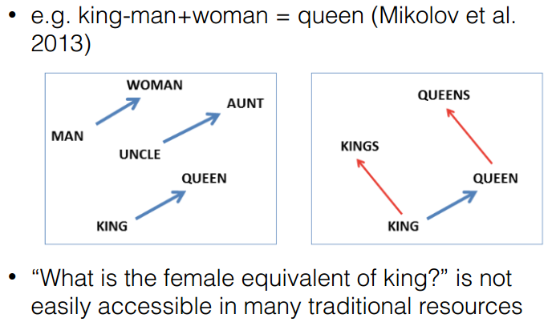{width="500px" height="300px" align="center"}

**Concepts**:
- **Word Embeddings**: 其实就是一个映射，将单词从原先所属的空间映射到新的多维空间中，也就是把原先词所在空间嵌入到一个新的空间中去。
- *Distributional*: words are similar if they appear in similar contexts, non-distributional created from lexical resources.
- *Distributed*: represented by a vector of values, each representing activations (features of syntax and semantics), local ones are represented by a discrete symbol.

## Basic Methods
- **Count-based Methods**: create a word-context count matrix
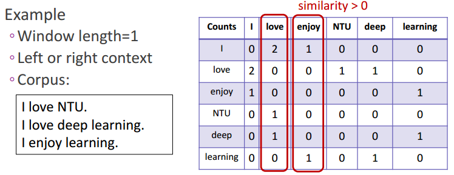{width="500px" height="200px" align="center"}

*Problems*:
	- matrix size increases with vocab;
	- high dimensional, sparsity;
*Solution*: get the low dimensional word vector by using *SVD* of co-occurrence matrix.

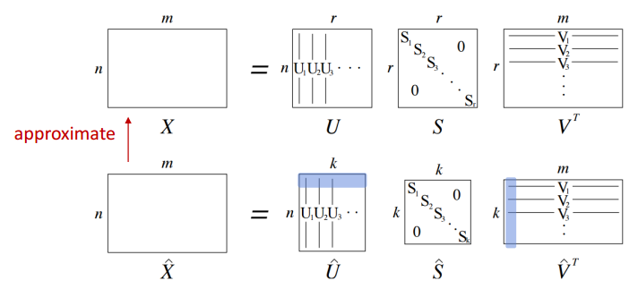{width="500px" height="200px" align="center"}

*Problems*:
	- computationally expensive;
	- difficult to add new words;
*Solution*: directly learn the low-dimensional word vectors.

- **Prediction-based Methods**: try to *predict* the words within a NN. Word embeddings are the byproduct.

-**Word2Vec** (Mikolov et al, NIPS 2013): **Skip-Gram** and **CBOW**
	-*Skip-Gram* vs *CBOW*: **Skip-Gram** predicts surrounding words within a window of each word, while **CBOW** predicts the target word given the surrounding words.
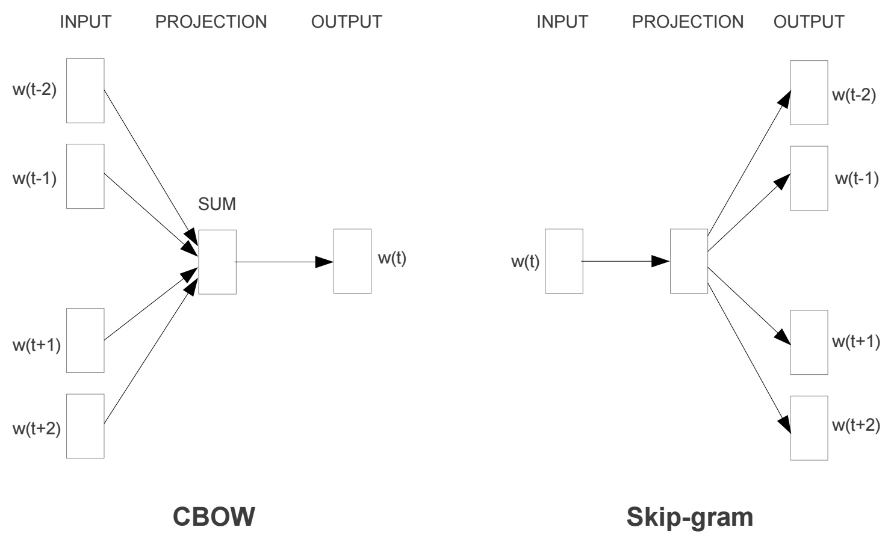{width="500px" height="300px" align="center"}
	
-**Skip-Gram**: Here is an example for how to collect the training sets. The network is probably going to get many more training samples of (“Soviet”, “Union”) than it is of (“Soviet”, “Sasquatch”). When the training is finished, if you give it the word “Soviet” as input, then it will output a much higher probability for “Union” or “Russia” than it will for “watermelon” or “kangaroo”.
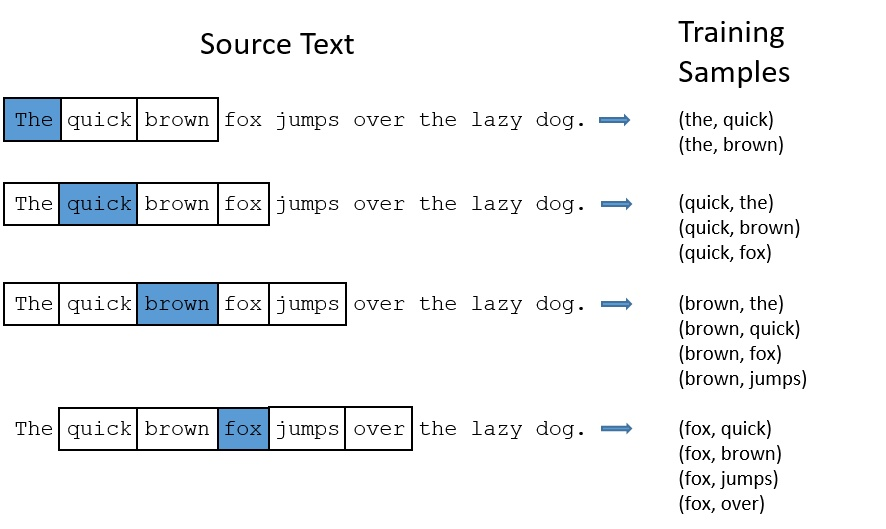{width="500px" height="300px" align="center"}
	- Model Architecture: There is **no activation function** on the hidden layer neurons, but the output neurons use softmax. 
	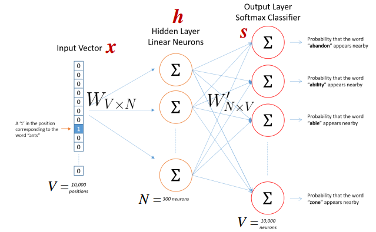{width="500px" height="300px" align="center"}
	- Hidden Layer Weight Matrix (word embedding): the end goal of all of this is really just to learn this **hidden layer weight matrix** – the output layer we’ll just toss when we’re done!
	{width="400px" height="300px" align="center"}
	- Output Layer: Specifically, each output neuron has a weight vector which it multiplies against the word vector from the hidden layer, then it applies the function exp(x) to the result. Finally, in order to get the outputs to sum up to 1, we divide this result by the sum of the results from all 10,000 output nodes. Here’s an illustration of calculating the output of the output neuron for the word “car”.
	{width="500px" height="100px" align="center"}
	- Potential Issue: large vocabularies or large training corpora will lead to expensive computations. We can limit the number of output vectors that must be updated per training instance: **Hierarchical Softmax** and **Negative Sampling**.
	- Negative Sampling.
		- Look at the example: When looking at word pairs, (“fox”, “the”) doesn’t tell us much about the meaning of “fox”. “the” appears in the context of pretty much every word.
		- **Subsampling**: For each word we encounter in our training text, there is a chance that we will effectively delete it from the text. The probability that we cut the word is related to the word’s frequency.
		- **Negative Sampling**: each training sample to update only a small percentage of the model’s weights. Previously, each training sample will tweak all of the weights in the neural network, our skip-gram neural network has a tremendous number of weights, all of which would be updated slightly by every one of our billions of training samples! 
		- Example: when training the network on the word pair (“fox”, “quick”), recall that the “label” or “correct output” of the network is a one-hot vector. That is, for the output neuron corresponding to “quick” to output a 1, and for all of the other thousands of output neurons to output a 0.  With negative sampling, we are instead going to randomly select just a small number of “negative” words (let’s say 5) to update the weights for. (“negative”: is one for which we want the network to output a 0 for). We will also still update the weights for our “positive” word (which is the word “quick” in our current example). The **“negative samples”** are selected using a **“unigram distribution”**, where more frequent words are more likely to be selected as negative samples.

- **Glove** (Pennington et al., EMNLP 2014)

- **Word  Vector Evaluation**

## Related SoTA Work
- [CoVe (NIPS2017)](https://arxiv.org/pdf/1708.00107.pdf) (**Co**ntextualized Word **Ve**ctors)
    - NMT captures the meaning of a sequence, it can provide the context for target tasks.
    - Outperform GloVe vectors on various tasks but not as strong as the simpler LM training.
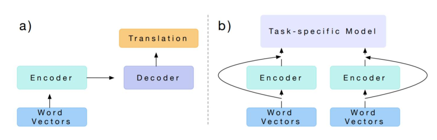{width="500px" height="200px" align="center"}

- [ELMo (NAACL2018)](https://aclweb.org/anthology/N18-1202) (**E**mbeddings from **L**anguage **Mo**dels)
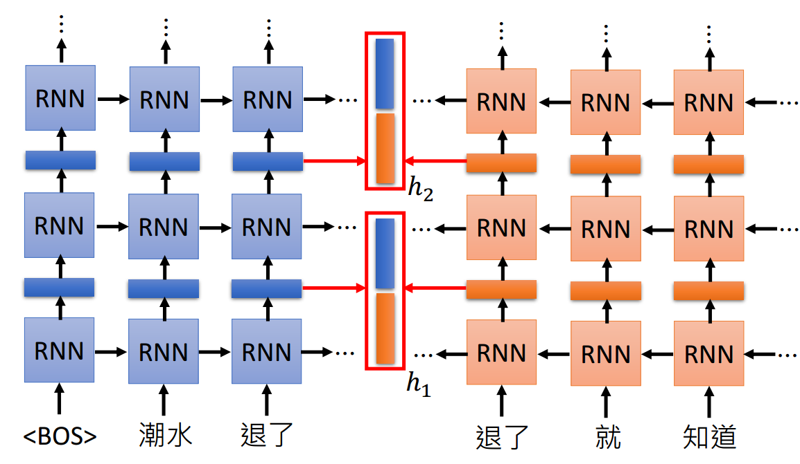{width="500px" height="250px" align="center"}
        
- [BERT(NAACL2019)](https://arxiv.org/pdf/1810.04805.pdf) (**B**idirectional **E**ncoder **R**epresentations from **T**ransformers)
    - [Transformer](https://papers.nips.cc/paper/7181-attention-is-all-you-need.pdf)3
    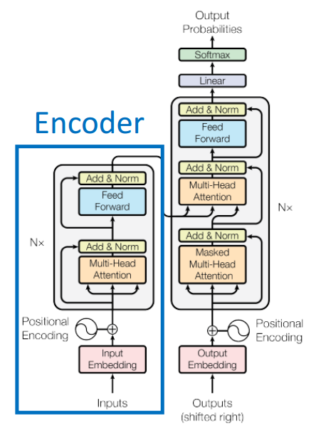{width="350px" height="500px" align="center"}
    - Masked LM
        - Masked some words out in a sentence and predict it
        - Trick
            - Not all words with [MASK] will be merely represented by [MASK]. Instead, 10 percent of words [MASK] will be shown in their original form, like 'dog' for 'dog', 20 percent of them will be replaced by random word, i.e. 'apple' for 'dog' and the others remain [MASK]. 
            - This training tricks mitigate the **unintended bias** resulting from special mark. That is to say, similar tricks can be reused if we have to introduce special mark in the model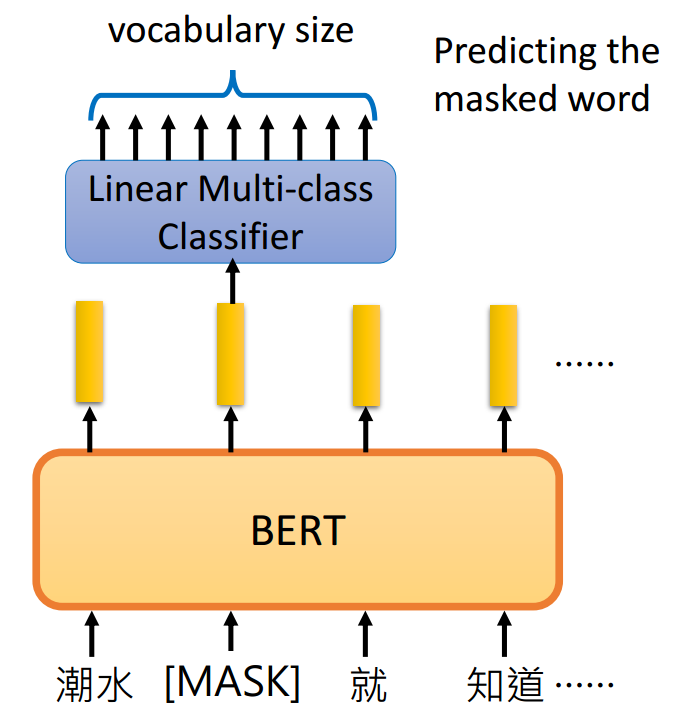{width="200px" height="200px" align="center"}
    - Next sentence prediction
        - Text-pair classification, which determines whether sentence A is followed by sentence B, semantically or logically
        - When choosing the sentences A and B for each pretraining example, 50% of the time B is the actual next sentence that follows A, and 50% of the time it is a random sentence from the corpus.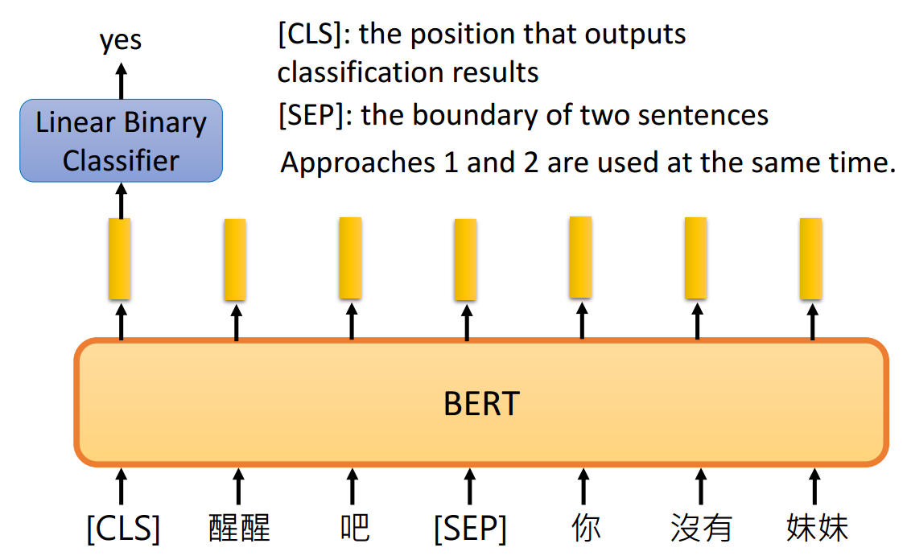{width="300px" height="200px" align="center"}
    - Model Details
        - WordPiece embeddings
        - learned positional embeddings
        - Stacked Tranformer encoder
        - Trained with masked LM and next sentence prediction
    - What does BERT learn?
        - BERT Rediscovers the Classical NLP Pipeline (ACL2019): BERT represents the steps of the traditional NLP pipeline in an interpretable and localizable way, and that the regions responsible for each step appear in the expected sequence: POS tagging, parsing, NER, semantic roles, then coreference. Qualitative analysis reveals that the model can and often does adjust this pipeline dynamically, revising lower level decisions on the basis of disambiguating information from higher-level representations.
        - What Does BERT Look At? An Analysis of BERT’s Attention: certain attention heads correspond well to linguistic notions of syntax and coreference. For example, we find heads that attend to the direct objects of verbs, determiners of nouns, objects of prepositions, and coreferent mentions with remarkably high accuracy. Substantial **syntactic** information is captured in BERT’s attention.
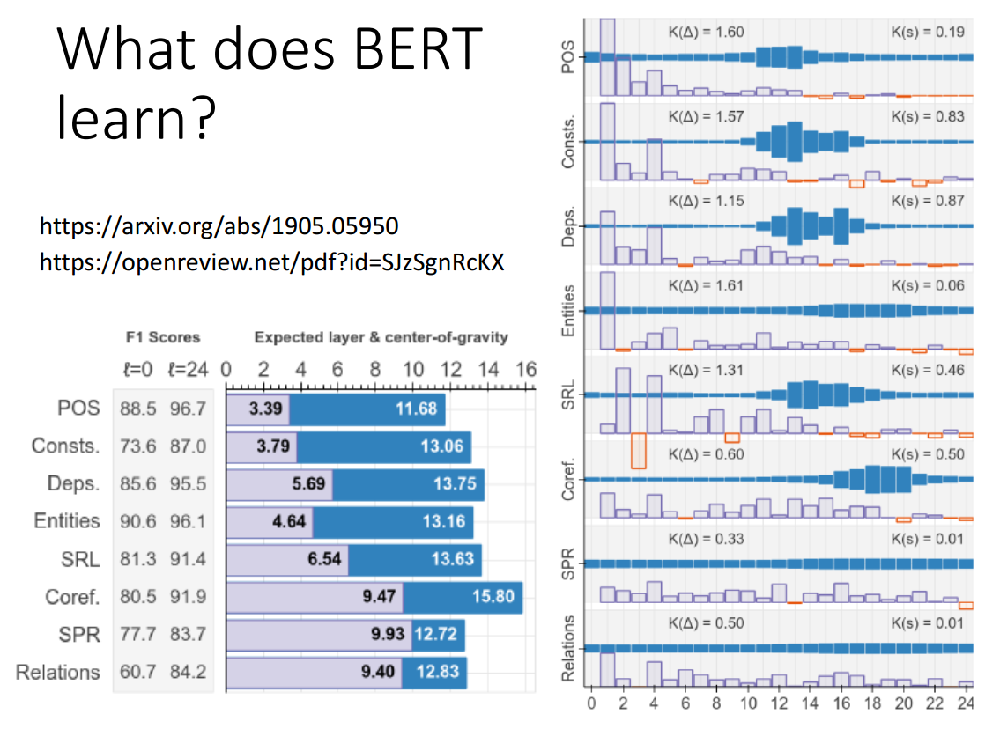{width="400px" height="250px" align="center"}
- [GPT] (Generative Pre-Training)
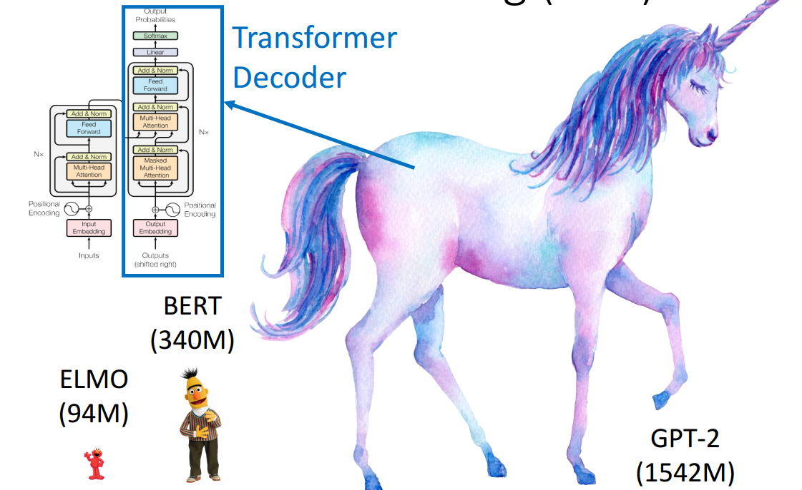{width="450px" height="250px" align="center"}
    - Zero shot learning
    	- Reading Comprehension: using "Q: $q_{1}$, $q_{2}$..." and "A:"
    	- Summarization: using "TL;DR:"
    	- Translation: using "="
     		

## Useful Links
1. 理解 Word2Vec 之 Skip-Gram 模型: https://zhuanlan.zhihu.com/p/27234078
2. The Annotated Transformer: http://nlp.seas.harvard.edu/2018/04/03/attention.html

