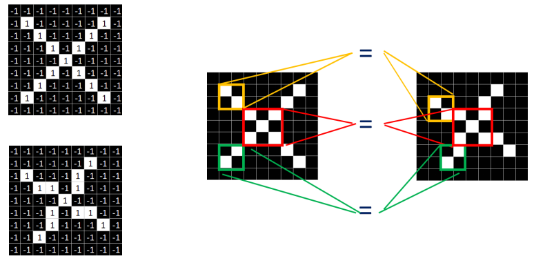
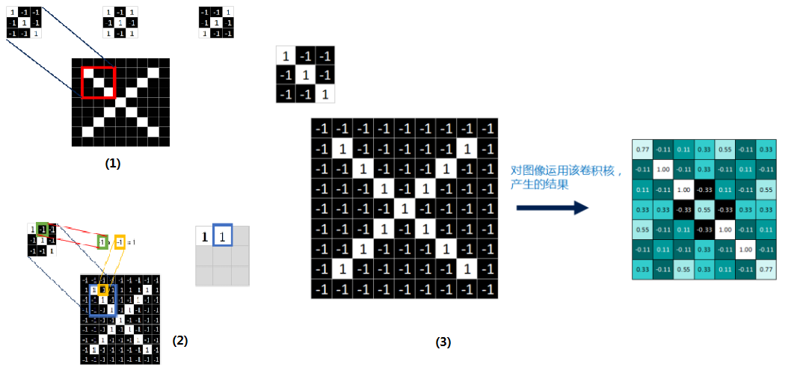
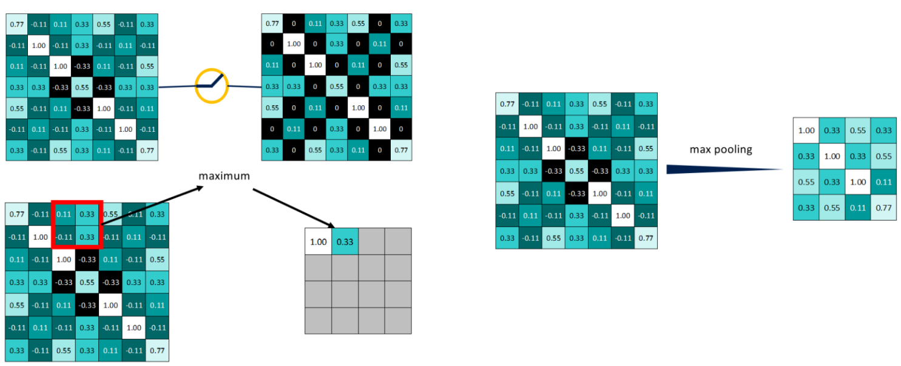
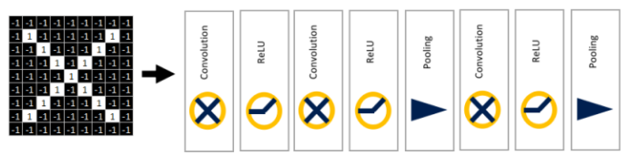
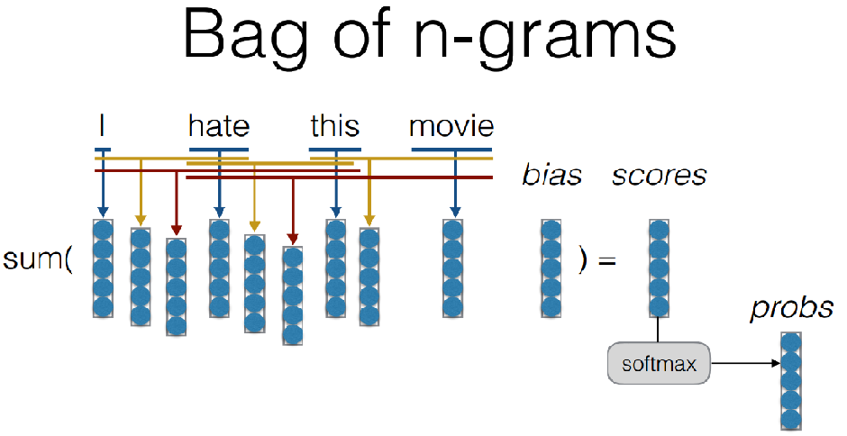
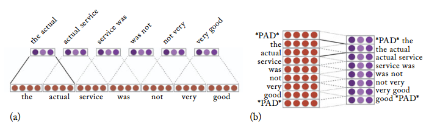
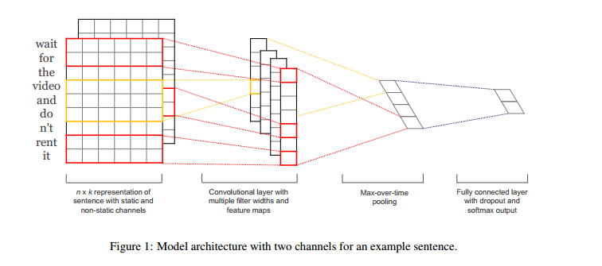

# Convolutional Neural Networks for NLP 

## Link
- slides link:http://phontron.com/class/nn4nlp2019/assets/slides/nn4nlp-04-cnn.pdf
- video link: https://www.youtube.com/watch?v=HBcr5jCBynI

Let's start with CNN for image firstly and then transfer the related knowledge to NLP.

### CNN for image

Per pixel comparison is impractical for image classification. 

*Fig.1. Comparing two images with 0 and 1 pixel values. The right two pictures show that their share some similar local features*

Convolutional Neural Networks is able to capture these local features by **filters**, which is also called **kerne**l or **feature detector**.  Here is a detailed demonstration and three filers are defined.

*Figure.2. (1) indicates that a filer can capture a feature in the image ( such as the nose of a face), Figure (2) illustrates element-wise multiplication of image pixel and filter, and these 9 values will be averaged to get a single value. A larger value indicates that these local 3x3 pixels match the feature very well. Figure (3) shows all matching values of the image for the filter*

Activation functions , then max pooling. 

### Motivation: CNN for NLP

**Q: Why we need CNN for NLP**

The CBOW vectors are unable to learn n-gram features, and
Bag of n-grams suffers 1)  parameter explosion problem and 2)  sharing among similar words/n-grams problem .

**A: CNN is able to learn n-gram features with shared filters **

## CNN for NLP

**-Filters**: can be 1D or 2D, in word unit or across word

**-Pooling**:  max pooling, average pooling, k-Max pooling, dynamic pooling.

**-Channels**:  different pre-trained word vectors

Narrow convolution VS wide convolution:

### A General llustration 

*llustration of a Convolutional Neural Network (CNN) architecture for sentence classification. Here we depict three filter region sizes: 2, 3 and 4, each of which has 2 filters. Every filter performs convolution on the sentence matrix and generates (variable-length) feature maps. Then 1-max pooling is performed over each map, i.e., the largest number from each feature map is recorded*

### SOTA

**[1] Convolutional Neural Networks for Sentence Classification**:

​	- Some key take aways:

- Multiple filter widths and feature maps improve the performance of a CNN model.

- Multi-channels architecture would prevent over fitting,. 

- Dropout plays an important role for the performance.

  

**[2] A Convolutional Neural Network for Modelling Sentences**

​	-Some key take aways:

- Dynamic k-max pooling is capable of capturing short and long-range relations.
  $$
  k_l = max (k_{top}, （L-l / L) * s)
  $$
  

  

  **[3] Encoding Sentences with Graph Convolutional Networks for Semantic Role Labeling**

  [4]** Is it Time to Swish? Comparing Deep Learning Activation Functions Across NLP tasks **

### Useful link
[1] Understanding Convolutional Neural Networks for NLP http://www.wildml.com/2015/11/understanding-convolutional-neural-networks-for-nlp/

[2] 卷积神经网络CNN完全指南终极版（一） https://zhuanlan.zhihu.com/p/27908027
