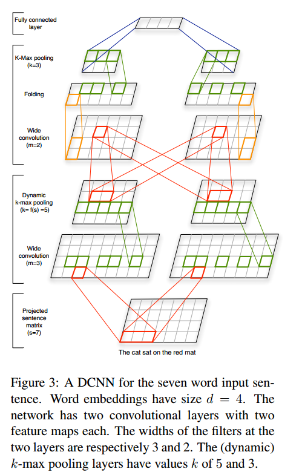

# Convolutional Neural Networks for NLP 

## Link
- slides link:http://phontron.com/class/nn4nlp2019/assets/slides/nn4nlp-04-cnn.pdf
- video link: https://www.youtube.com/watch?v=HBcr5jCBynI

### CNN for image

Let's start with CNN for image firstly and then transfer the related knowledge to NLP.

Per pixel comparison is impractical for image classification. 

*Fig.1. Comparing two images with 0 and 1 pixel values. The right two pictures show that their share some similar local features*

Convolutional Neural Networks is able to capture these local features by **filters**, which is also called **kerne**l or **feature detector**.  Here is a detailed demonstration and three filers are defined.

*Figure.2. (1) indicates that a filer can capture a feature in the image ( such as the nose of a face), Figure (2) illustrates element-wise multiplication of image pixel and filter, and these 9 values will be averaged to get a single value. A larger value indicates that these local 3x3 pixels match the feature very well. Figure (3) shows all matching values of the image for the filter*

Activation functions , then max pooling. 

### Motivation: CNN for NLP

**Q: Why we need CNN for NLP**

Bag of Word (BoW) or Contineous Bag of Word (CBoW) vectors operates all word embeddings without considering their positions, while an n-gram feature contains the position information for the words in segmentation. Hence, The CBOW vectors are unable to learn n-gram features.

Bag of n-gram enumulates all combinations of contineous words and may cause **parameter explosion** problem and could not 
share among similar words/n-grams problem .

**A: CNN is able to learn n-gram features with shared filters **

## CNN for NLP

**-Filters**: can be 1D or 2D in word unit (1D) or across word (2D).

**-Pooling**: for extracting sailent features. Pooling includes max pooling, average pooling, k-Max pooling, dynamic pooling, etc. it will lead to the loss of words' positional information.

**-Channels**:  different pre-trained word vectors.

-**Activation Function**: See the summary below.

Narrow convolution VS wide convolution:

### A General llustration 
There is a 1D CNN with 6 filers. 1D indicates that convoluation performed along the squence in words level and the output of convolutons on sentence by each filer is a vector (the output of 2D CNN is a matrix). Each value in the output vector represents the feature of a word-level n-gram, eg, for the 4X5 filer, the output vector contains the features of "I like this movie", "like this movie very", "this movie very much", and "movie very much!". 

*llustration of a Convolutional Neural Network (CNN) architecture for sentence classification. Here we depict three filter region sizes: 2, 3 and 4, each of which has 2 filters. Every filter performs convolution on the sentence matrix and generates (variable-length) feature maps. Then 1-max pooling is performed over each map, i.e., the largest number from each feature map is recorded*

## CNN Variants:

### Stack CNN

The higher level of stack CNN can capture longer range relations. Note that no pooling is performed between each convolution layer.

### Structure CNN

### SOTA

**[1] Convolutional Neural Networks for Sentence Classification**:

​	- Some key take aways:

- Multiple filter widths and feature maps improve the performance of a CNN model.

- Multi-channels architecture would prevent over fitting,. 

- Dropout plays an important role for the performance.

  

**[2] A Convolutional Neural Network for Modelling Sentences**

​	-Some key take aways:

- Dynamic k-max pooling is capable of capturing short and long-range relations.
  $$
  k_l = max (k_{top}, （L-l / L) * s)
  $$
  

  

  **[3]Is it Time to Swish? Comparing Deep Learning Activation Functions Across NLP tasks**-EMNLP2018

  ​	key take aways:

  - elu and selu perform best among 12 activation functions for document classification using a CNN wit 1-D convolution.  
  - The most stable activation functions are the maxout, penalized tanh, tanh and sin.
  - Relu perform worse than half of the activation functions for the task.

  

  **[4] Dependency-based CNN for sentence embedding**-ACL2015

  ​	key take aways:

  - CNN only consider sequential n-grams that are consecutive on the surface string and neglect long distance dependencies. 
  - Convolution on dependency path

  **[5] Encoding Sentences with Graph Convolutional Networks for Semantic Role Labeling**-EMNLP 2017.

  

### Dicussion:
1. why the 1D convolution works?
2. 
### To be done:
-Add additional intro of dynamic pooling
-Add Fair sequence
-Add Dialated CNN
-Sensitive Analysis
  A Sensitivity Analysis of (and Practitioners' Guide to) Convolutional Neural Networks for Sentence Classification

### Useful link
[1] Understanding Convolutional Neural Networks for NLP http://www.wildml.com/2015/11/understanding-convolutional-neural-networks-for-nlp/

[2] 卷积神经网络CNN完全指南终极版（一） https://zhuanlan.zhihu.com/p/27908027

