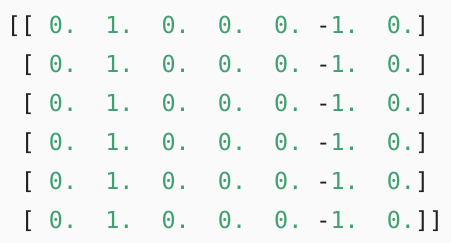

# CNN: From LeNet to DenseNet
by zhijiang

## Motivation
Key principles for building NNs for CV:

- **Translation Invariance:** The system should respond similarly to the same object regardless of where it appears in the image.
- **Locality:**: The system should focus on local regions, without regard for what else is happening in the image at greater distances. 
- **All learning depends on imposing inductive bias:** here we deduce the convolution by incorporating these two assumptions.
{width="400px" height="50px" align="center"}
For any given location (i, j) in the hidden layer h[i, j] of a MLP, we compute its value by summing over pixels in x, centered around (i, j) and weighted by V[i, j, a, b].
	- **Translation Invariance:**  This is only possible if V doesn't actually depend on (i, j):{width="200px" height="50px" align="center"}. This reduces the number of parameters by a factor of 1 million (for 1 megapixel image) since it no longer depends on the location within the image.
	- **Locality:** we should not look very far away from (i, j) in order to glean relevant information to assess what is going on at h[i, j]: {width="200px" height="50px" align="center"}. Outside some range |a|, |b| > delta, V[a, b] = 0.

## Concepts

- **Convolutions for Images:** 
	- **Kernel (Filter)**:  {width="250px",  height="100px", align="center"}.
	- **Edge Detection**: The middle 4 columns are black and the rest are white. {width="150px",  height="100px", align="center"}.
We construct a kernel with a height of 1 and width of 2 ([1, -1]). As the result here, we will detect **1** for the **edge from white to black** and **-1** for the **edge from black to whilte**. The result of the outputs are 0.
{width="150px",  height="100px", align="center"}.
In practice, we learn the kernel by looking at the (input, output) pairs only. We initialize kernel as a random arry. Next, in each iteration, we will use the squared error to compare Y and the output, then calculate the gradient to update the weight.

- **Padding and Stride**
	- **Output shape:** assume the input shape in Nh x Nw and the kernel window is Kh x Kw, then the output shape is:{width="300px",  height="50px", align="center"}.
	- **Motivation:**
		- Since kernels generally have width and height greater than 1. After applying many successive convolutions, we will wind up with an output that is much smaller than our input. *Padding* handles this issue.
		- In some cases, we want to reduce the resolution drastically, if say we find our originall input resolution to be unwieldy.
	- **Padding:** assume padding size is Ph and Pw. In many case, we will want to set Ph = Kh - 1 and Pw = Pw - 1 to give the input and output the same height and width.  {width="300px",  height="40px", align="center"}. CNN commonly use kernels with **odd** height and width values, so we can preserve the spatial dimensionality while padding with the same number of rows (columns) on top and bottom.
	{width="250px",  height="100px", align="center"}.
	- **Stride:** for computational efficiency or downsample, we have stride: {width="300px",  height="40px", align="center"}. 
	{width="250px",  height="100px", align="center"}.
	
	
- **Multiple Channels:** we sum over the channels.
{width="500px",  height="200px", align="center"}.
	- **Multiple Output Channels:**it turns out to be essential to have multiple channels at each layer. Actually we increase the channel dimension as we go higher up in the NN, typically downsompling to trade off spatial resolution for greater channel depth. You could think each channel as responding to some different set of features (feature map)
	- **Shape of the kernels:** assume Ci and Co are the number of input and output channels. For each output channel we create Ci x Kh x Kw kernels. We concat them on the output channel dimension, so that the shape of the kernel is Co x Ci x Kh x Kw. 
	
- **Pooling:** dual purpose"
	- **Mitigate the sensitivity of convolutional layers to location:** in reality, objects hardly ever occur exactly at the same place. Assume in edge detection, the conv layer input is X and the pooling output is Y. Whether or not the values of X[i, j] and X[i, j+1] are different, or X[i, j+1] and X[i, j+2] are different, the max pooling (2 x 2) layer outputs all include Y[i, j]=1. We can still detect if the pattern recognized by the conv layer moves no more than 1 element in height and width.
	- **Spatially Downsample:** as we process images, we want to gradually reduce the spatial resolution of our hidden representations, aggregating information so that the higher up we go in the network, the larger the **receptive field**  to which each hidden node is sensitive. 

- **1 x 1 Convolutional Layer:** 1 X 1 convolution loses the ability to recognize patterns consisting of interactions among adjacent elements in the height and width dimensions. **The only computation of the 1 x 1 convolution occurs on the channel dimension**
{width="500px",  height="200px", align="center"}.
Each element in the output is derived from a linear combination of elements *at the same position* in the input image. You could think the 1 x 1 as constituing a fully-connected layer applied at every single pixel location to transform the Ci input values into Co output values. This layer requires Co x Ci weights.

## CNN Architectures

- **LeNet**: (LeCun, Y., Bottou, L., Bengio, Y., & Haffner, P. (1998). Gradient-based learning applied to document recognition. Proceedings of the IEEE): LeNet was the first successful deployment of CNN, a network using convolutional layers. Their model achieved outstanding results at the time (only matched by SVM) and was adopted to recognize digits for processing deposits in ATM machines.{width="500px",  height="200px", align="center"}
	- **Arch**: recognize the spatial patterns in the image, such as lines and the parts of objects, and the subsequent average pooling layer is used to reduce the dimensionality. 
	- **Conv Layer**: Each convolutional layer uses a  5×5  kernel and processes each output with a sigmoid activation function (again, note that ReLUs are now known to work more reliably, but had not been invented yet).
	- **Pooling Layer**:  two average pooling layers are of size  2×2  and take stride 2 (note that this means they are non-overlapping). In other words, the pooling layer downsamples the representation to be precisely one quarter the pre-pooling size.
	- **Fully-Connected Layer**: flatten each example in the mini-batch. Take this 4D input and tansform it into the 2D input expected by fully-connected layers.
	{width="100px",  height="200px", align="center"}

- **AlexNet**: (Krizhevsky, A., Sutskever, I., & Hinton, G. E. NIPS2012. Imagenet classification with deep convolutional neural networks. ) between the early 1990s and 2012, NNs were often surpassed by other machine learning methods, such as SVM.
	- **Manual Features**:
		- **Pipeline**: typical CV pipelines consisted of **manually engineering feature**. Rather than **learn** the features, the features were **crafted**. Most of the progress came from having more clever ideas for **features** (SIFT: the Scale-Invariant Feature Transform,  SURF: the Speeded-Up Robust Features,), rather than the learning algorithm.
		- **NNs are hard to Train**: key tricks for training deep multichannel, multilayer convolutional neural networks with a large number of parameters including **parameter initialization** heuristics, clever variants of **stochastic gradient descent**, **non-squashing activation** functions, and effective **regularization** techniques were still missing.
	- **Learning Features**:  Yann LeCun, Geoff Hinton, Yoshua Bengio ... believed that features themselves ought to be learned. They ought to be hierarchically composed with multiple jointly learned layers, each with learnable parameters. 
		- CNN: In the case of an image, the lowest layers might come to *detect edges, colors, and textures*. Interestingly in the **lowest layers of the network**, the model learned **feature extractors that resembled some traditional filters**.
	{width="300px",  height="200px", align="center"}
	**Higher layers** in the network might build upon these representations to represent **larger structures**, like eyes, noses, blades of grass, etc. Even higher layers might represent **whole objects** like people, airplanes, dogs, or frisbees. Ultimately, the final hidden state learns a compact representation of the image that summarizes its contents.
		- **Breakthrough at 2012**: can be attributed to two key factors data and hardware. **ImageNet**: 1 million examples, 1,000 each from 1,000 distinct categories of objects. **GPUs**: they were optimized for high throughput 4x4 matrix-vector products, which are needed for many computer graphics tasks (games). Fortunately, this math is strikingly similar to that required to calculate convolutional layers. **People**: Alex Krizhevsky and Ilya Sutskever implemented a deep CNNs that could run on GPU. The computational bottlenecks in CNNs (convolutions and matrix multiplications) are all operations that could be parallelized in hardware ( 2 NIVIDA GTX 580s with 3GB of memory)
	- **Arch**: first filter is 11×11, since objects in ImageNet data tend to occupy more pixels. Consequently, a larger convolution window is needed to capture the object. The network adds maximum pooling. AlexNet has ten times more convolution channels than LeNet. Last are two fully-connected layers with 4096 outputs. These two huge layers produce model parameters of nearly 1 GB. AlexNet used a dual data stream design, so that each of their two GPUs could be responsible for storing and computing only its half of the model. 
	{width="300px",  height="400px", align="center"}
	- **ReLU**: when the output of the sigmoid is very close to **0 or 1**, the **gradient** of these regions is almost 0, so that back propagation cannot continue to update some of the model parameters. In contrast, the gradient of the ReLU activation function in the **positive interval is always 1**.
	- **Dropout**: 可以约束网络复杂度，还是一种针对NN的ensemble learning. 由于神经元互联，对于某个神经元来说，反向传播的梯度信息同时也受到其他神经元的影响，即是complex cp-adaptation effect. Dropout可以降低神经元之间的以来，避免了overfitting。
		- Train: 以概率p随机将该神经元权重置为0。
		- Test: 所有神经元激活，但权重需要乘以(1-p)来保证training and testing各自权重拥有相同的expectation。
		- Ensemble: 由于失活的神经元无法参与训练，所有每次训练（forward and backward）相当于面对一个全新的网络。对于AlexNet和VGG的fully-connected layers来说，dropout之后就是指数级exponentially
子网络的网络集成。	
{width="300px",  height="200px", align="center"}

- **VGG**: (Simonyan, K., & Zisserman, A. ICLR2015. Very deep convolutional networks for large-scale image recognition.) 
	- **Motivation**: the design of NN architectures had grown progressively more abstract, with researchers moving from thinking in terms of **individual neurons to whole layers, and now to blocks**, repeating patterns of layers.
	- **Block**: One VGG block consists of a sequence of convolutional layers, followed by a max pooling layer for spatial downsampling.
	{width="300px",  height="350px", align="center"}
	- **Variants**: VGG constructs a network using reusable convolutional blocks. Different VGG models can be defined by the differences in the number of convolutional layers and output channels in each block.
	{width="300px",  height="350px", align="center"}
	- **Deeper Other than Wider**: several layers of deep and narrow convolutions (i.e.  3×3 ) were more effective than fewer layers of wider convolutions.

- **NiN**: (Lin, M., Chen, Q., & Yan, S. ICLR2014. Network in network)
	- **Motivation**: The improvements upon LeNet by AlexNet and VGG mainly lie in how these later networks widen and deepen convolutions and pooling layers. . **Dense layers** might give up the **spatial structure of the representation entirely**, NiN blocks offer an alternative. They use an MLP on the channels for each pixel separately. 1×1 卷积层可以看成全连接层，其中空间维度（高和宽）上的每个元素相当于样本，通道相当于特征。因此，NiN使用 1×1 卷积层来替代全连接层，从而使空间信息能够自然传递到后面的层中去。
	- **Arch**: The NiN block consists of one convolutional layer followed by two  1×1  convolutional layers that act as per-pixel fully-connected layers with ReLU activations.
	{width="300px",  height="400px", align="center"}
	- **Advantage**: significantly reduces the number of required model parameters,  since NiN block with a number of output channels equal to the number of label classes, followed by a global average pooling layer, yielding a vector of logits
sequential1 output shape:        (1, 96, 54, 54)
pool0 output shape:      (1, 96, 26, 26)
sequential2 output shape:        (1, 256, 26, 26)
pool1 output shape:      (1, 256, 12, 12)
sequential3 output shape:        (1, 384, 12, 12)
pool2 output shape:      (1, 384, 5, 5)
dropout0 output shape:   (1, 384, 5, 5)
sequential4 output shape:        (1, 10, 5, 5)
pool3 output shape:      (1, 10, 1, 1)
flatten0 output shape:   (1, 10)
	 

- **GoogleNet**: (Szegedy, C., Liu, W., Jia, Y., Sermanet, P., Reed, S., & Anguelov, D. & Rabinovich, A. CVPR2015. Going deeper with convolutions.) They want to address the question of which sized convolutional kernels are best. 
	- **Motivation**: sometimes it can be advantageous to employ a combination of variously-sized kernels. 
	- **Arch**: The basic convolutional block in GoogLeNet is called an Inception block, likely named due to a quote from the movie Inception
	{width="600px",  height="300px", align="center"}
	- **Combination of Kernels**: inception block consists of four parallel paths. The first three paths use convolutional layers extract information from different spatial sizes. The 1×1  convolution on the input to reduce the number of input channels, reducing the model’s complexity. Finally, the outputs along each path are concatenated along the channel dimension and comprise the block’s output. The commonly-tuned parameters of the Inception block are **the number of output channels per layer**.
		- Inception: equivalent to a subnetwork with four paths.
		- 1x1 Conv: reduce channel dimensionality on a per-pixel level.
		- advantage: one of the **most efficient** models on ImageNet, providing similar test accuracy with lower computational complexity.

- **ResNet**

- **DenseNet**

## Useful Links

