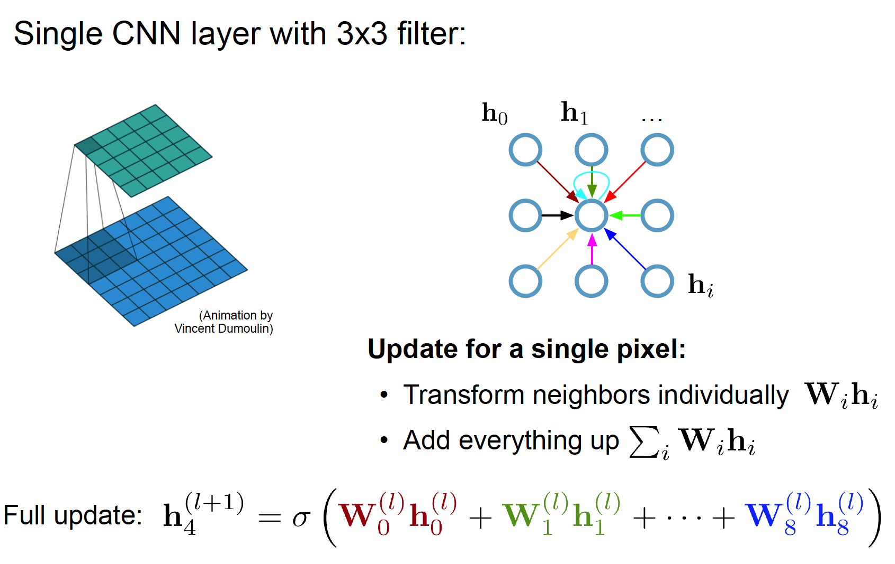

by guoshun

## Motivation

**CNN is unable to  handle non-Euclidean data by shared tunable kernels, While GNN can operate on graph domain. Let's see the details of why we use GNN**

Firstly, let's see the convolutionals on Euclidean data (grids, sequences). The update for sequences by RNN and grids by CNN can be formulated as. 

Here is a demostration of 3X3 convolution on grid data and the udpate:

## 

What if our data looks like this? such as data from social networks, word-wild-web, knowledge graphs, telecommunication network. Can we still use RNN or CNN as a convolution operator?

Obviously we can not use RNN or CNN directly to model graph data. Let's give the definitions of graphs. G=(V, E) indicates a set a nodes V: {v_i} and edges E: {(v_i, v_j)}, where a edge (v_i, v_j) represents a connection between node v_i and node v_j. We also define define adjacent matrix A , A_{ij} = 1 if (v_i, v_j) is in the set E.

### Question:

Can we feed the GCN network into deep FFN and what are the problems?   

Let's X_{in} = [X, A] denote the input of deep FNN, X and A indicate feature matrix and ajacent matrix, respectively.  The problems are:

- Huge number of parameters O(N), N indicates the length of feature matrix.

- Needs to be re-trained if number of nodes changes.

- Does not generalize across graphs

  

Let's X_{in} = [X, A] denote the input of deep FNN, X and A indicate feature matrix and ajacent matrix, respectively.  The problems are:

Or treat self-connection in the same way.

## Variants of GNN:

***Directed graphs***: 

***Heterogeneous graphs***:  there are several kinds of nodes and each type of nodes is converted into a one-hot feature. 

***Graphs with edge information***: Relational GCN

## Propogation Steps

## Variants of GCN

The variants of GNN include GCN, GCNN, GAT, Gated GNN, Graph LSTM, and the main difference lies in their aggregator. 

For details Please refer to Table of of paper [2] Graph Nerual Networks: A review of methods and Applications 

## SOTA

[1] Simplifying Graph Convolutional Networks (SGC), ICML 2019

***Motivatin***: can we reduce the excess complexity and redundant computation of GCN?

**Insights: A linear model (SGC) is sufficient on many graph tasks.**

SGC performan on par with or better than GCN across 5 tasks including 14 datasets for graph classification, text classification, semi-supervised user geolocation, relation extraction and zero-shot image classification.

[2] Position-aware Graph Neural Networks, ICML 2019

Motivation: Learning node embedding that capture a node's position within the broader graph strucgure is crutial for many prediction task. However, existing work have limited power in capturing the position/location of a given node with respect to all other nodes of the graph.

[3] LatentGNN: Learning Efficient Non-local Relations for Visual Recognition, ICML 2019

Motivation:  to model non-local  context relations for capturing  **long-range dependencies** in feature representations.

[4] Mixhop: Higher-Order Graph Convolutional Architectures via Sparsified Neighborhood Mixing

## Useful Link

[1]Graph Convolution Networks:  <https://tkipf.github.io/graph-convolutional-networks/>  by Thomas Kipf

[2]Graph Nerual Networks: A review of methods and Applications.<https://arxiv.org/pdf/1812.08434.pdf>

$$
h^{l+1}_i = \sigma (h^l_i W^l_0  + \sum_{j \in N_i} \frac{1}{c_{ij}} h^l_j W^l_1 + b^l)
\\
H^{l+1} = \sigma (H^l W^l_0 + \widetilde{A}H^lW^l_1 + b^l)
\\
\widetilde{A} = D^{-1/2} A D^{-1/2}
\\

H^{l+1} = \sigma (\widetilde{A} H^l W^l + b^l)
\\
\hat{A} = D^{-1/2} (A + I_N) D^{-1/2}
$$

$$
_{ij}} h^l_j W^l_1 + b^l)
\\
H^{l+1} = \sigma (H^l W^l_0 + \widetilde{A}H^lW^l_1 + b^l)
\\
\widetilde{A} = D^{-1/2} A D^{-1/2}
\\

H^{l+1} = \sigma (\widetilde{A} H^l W^l + b^l)
\\
\hat{A} = D^{-1/2} (A + I_N) D^{-1/2}
$$

