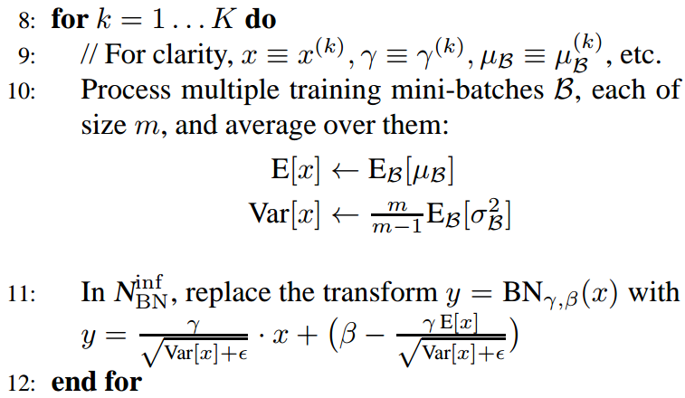
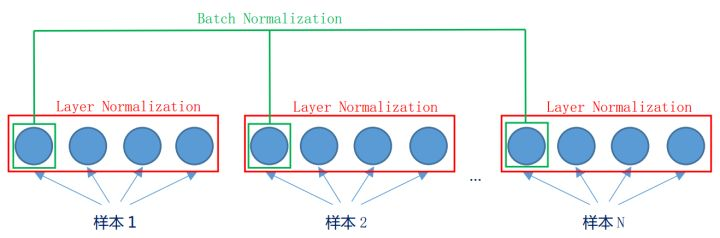

# Batch Normalization v.s. Layer Normalization
by zhijiang

- Ioffe S, Szegedy C. Batch normalization: accelerating deep network training by reducing internal covariate shift. ICML2015
- Jimmy Lei Ba, Jamie Ryan Kiros, Geoffrey E. Hinton Layer Normalization

## Motivation
- **Training DNN is Complicated:** the inputs to each layer are affected by the parameters of **all preceding layers** -- so that small changes to the network parameters amplify as the network become deeper (蝴蝶效应).
- **Covariate Shift:** (from Domain Adaptation) when the input distribution to a learning system changes. The change in the distributions of layers' inputs presents a problem because the layers need to **continously adapt to the new distribution.**
- **Internal Covariate Shift:** change in the distribution of network activations due to the change in network parameters during training.
- **理解：** 随着梯度下降的进行，每一层的参数W与b都会被更新，那么z=Wx+b的分布也就发生了改变，进而A_{l} = F(z)也同样出现分布的改变。而A_{l}作为第l=1层的输入，意味着l+1层就需要去不停适应这种数据分布的变化

## Problems
- **上层网络需要不停调整来适应输入数据分布的变化，导致网络学习速率降低**；
- **网络的训练过程容易陷入梯度饱和区（saturated regime），减缓网络收敛速度**:
	- ReLU;
	- Normalization: ensure the distribution of nonlinearity input remains stable.

## Solutions

- **Whitening**:  linearly transformed to have zero
means and unit variances, and decorrelated （对输入数据分布进行变换，使得输入特征分布具有相同的均值和方差，同时去除了特征之间的相关性。 LeCun, Y., Bottou, L., Orr, G., and Muller, K. Efficient backprop. 1998 ）
	- 计算成本太高：
	- 减弱了网络中每一层输入数据表达能力： 下层神经元可能很努力地在学习，但不论其如何变化，其输出的结果在交给上层神经元进行处理之前，将被粗暴地重新调整到这一固定范围。

- **Batch Normalization:**
	- Improvements:
		- 单独对每个特征进行normalization，让每个特征都有均值为0，方差为1的分布；
		- 加一个线性变换操作，使得 Normalization 层可以学习如何去尊重底层的学习结果（能够尽可能恢复本身的表达能力）。
	- Algorithm:
	{width="350px",  height="300px", align="center"}.
	- Example:
	{width="450px",  height="300px", align="center"}.
	{width="450px",  height="300px", align="center"}.
	- Learnable Parameters (Gamma & Beta): 这两个参数的引入是为了恢复数据本身的表达能力，对规范化后的数据进行线性变换，即z` = gamma * z + beta 。特别地，当gamma^{2} = variance, beta = mean 时，可以实现等价变换（identity transform）并且保留了原始输入特征的分布信息。
	- Testing Phrase: mean, variance 都是基于当前batch中的训练数据来计算。 预测的时候：有可能只需要预测一个样本或很少的样本，没有像训练样本中那么多的数据，此时 mean与 variance 的计算一定是有偏估计.
	{width="450px",  height="300px", align="center"}.
	利用BN训练好模型后，我们保留了每组mini-batch训练数据在网络中每一层的mean_{batch}与variance_{batch} 。此时我们使用整个样本的统计量来对Test数据进行归一化，具体来说使用均值与方差的无偏估计：
	- Advantage:
		- BN使得网络中每层输入数据的分布相对稳定，加速模型学习速度: 后一层网络不必不断去适应底层网络中输入的变化，从而实现了网络中层与层之间的解耦，允许每一层进行独立学习
		- BN就保证了梯度不会依赖于**参数的scale**，使得参数的更新处在更加稳定的状态: 抑制了参数微小变化随着网络层数加深被放大的问题，使得网络对参数大小的适应能力更强，此时我们可以设置较大的学习率而不用过于担心模型divergence的风险。
		- BN允许网络使用饱和性激活函数（例如sigmoid，tanh等），缓解梯度消失问题: 通过normalize操作可以让激活函数的输入数据落在**梯度非饱和区**，缓解梯度消失的问题；另外通过自适应学习 gamma 与 beta 又**让数据保留更多的原始信息**。
		- BN具有一定的正则化效果（regularization）:尽管每一个batch中的数据都是从总体样本中抽样得到，但不同mini-batch的均值与方差会有所不同，这就为网络的学习过程中**增加了随机噪音**，与Dropout通过关闭神经元给网络训练带来噪音类似，在一定程度上对模型起到了正则化的效果。实验证明丢弃Dropout，模型也同样具有很好的泛化效果。
	- Disadvantage:
		- Batch的尺寸小时：样本的均值和方差便不能反映全局的分布信息，所以基于少量样本的BN的效果会变得很差。
		- 在类似于RNN的动态网络： 各个样本的长度都是不同的，当统计到比较靠后的时间片时，这时只有一个样本还有数据，基于这个样本的统计信息不能反映全局分布；	
		- 训练数据集和测试数据集方差较大的时候。
		
## Insights
Santurkar S, Tsipras D, Ilyas A, et al. How Does Batch Normalization Help Optimization?(No, It Is Not About Internal Covariate Shift), NIPS2018

- BN与ICS无关：
	- 第一个实验: We train networks with **random noise injected after BatchNorm** layers. Specifically, we perturb each activation for each sample in the batch using i.i.d. noise sampled from a non-zero mean and non-unit variance distribution. 
		- Such noise injection produces a severe covariate shift that skews activations at every time step. Consequently, every unit in the layer experiences a different distribution of inputs. We then measure the effect of this deliberately introduced distributional instability on BatchNorm’s performance.
		-  “noisy” BatchNorm network has qualitatively *less stable distributions than even the standard*, non-BatchNorm network, yet it *still performs better* in terms of training.
		{width="400px",  height="200px", align="center"}.
	- 第二个实验： For a layer we measure the cosine angle (ideally 1) and l2-difference of the gradients (ideally 0) before and after updates to the preceding layers. Models with BatchNorm have similar, or even worse, internal covariate shift, despite performing better in terms of accuracy and loss.
	{width="400px",  height="200px", align="center"}.
	This is particularly striking in the case of DLN. In fact, in this case, the standard network experiences almost no ICS for the entirety of training, whereas for BatchNorm it appears that G and G` are almost uncorrelated.
	
- BN与损失平面：作者认为BN的作用是平滑了损失平面（loss landscape），ResNet和DenseNet均起到了平滑损失平面的作用，因此他们具有较快的收敛速度。
	- BN处理之后的损失函数满足Lipschitz连续(proved): 即损失函数的梯度小于一个常量，因此网络的损失平面不会震荡的过于严重。
	- 损失函数的梯度也满足Lipschitz连续(proved): 这里叫做 Beta -平滑，即斜率的斜率也不会超过一个常量。
	{width="400px",  height="200px", align="center"}.
	- BN收敛快的原因: 产生了更光滑的损失平面。其实类似于BN的能平滑损失平面的策略均能起到加速收敛的效果，作者在论文中尝试了其他norm的策略，它们均取得了和BN类似的效果。

## Layer Normalization

- 与Batch Normalization的区别：batch是“竖”着来的，各个维度做归一化，所以与batch size有关系。layer是“横”着来的，对一个样本，不同的神经元neuron间做归一化。
{width="400px",  height="150px", align="center"}.
{width="400px",  height="200px", align="center"}.
- 在BN和LN都能使用的场景中，BN的效果一般优于LN，原因是基于不同数据，同一特征得到的归一化特征更不容易损失信息.
	- Example： 而 LN 对于一整层的神经元训练得到同一个转换——所有的输入都在同一个区间范围内。如果不同输入特征不属于相似的类别（比如颜色和大小），那么 LN 的处理可能会降低模型的表达能力。
	
## Summary

- Normalization 的权重伸缩不变性(weight scale invariance）:当权重 W 按照常量 lambda 进行伸缩时，得到的规范化后的值保持不变.
{width="500px",  height="200px", align="center"}.
	- 权重的伸缩变化不会影响反向梯度的 Jacobian 矩阵，因此也就对反向传播没有影响，避免了反向传播时因为权重过大或过小导致的梯度消失或梯度爆炸问题，从而加速了神经网络的训练。
	{width="300px",  height="100px", align="center"}.
	- 权重值越大，其梯度就越小。这样，参数的变化就越稳定，相当于实现了参数正则化的效果，避免参数的大幅震荡，提高网络的泛化性能。
	{width="400px",  height="100px", align="center"}.
	
- Normalization 的数据伸缩不变性（data scale invariance）指的是，当数据 x 按照常量 lambda 进行伸缩时，得到的规范化后的值保持不变. 每一层神经元的输出依赖于底下各层的计算结果。如果没有正则化，当下层输入发生伸缩变化时，经过层层传递，可能会导致数据发生剧烈的膨胀或者弥散，从而也导致了反向计算时的梯度爆炸或梯度弥散。加入 Normalization 之后，不论底层的数据如何变化，对于某一层神经元而言，其输入永远保持标准的分布，这就使得高层的训练更加简单。数据的伸缩变化也不会影响到对该层的权重参数更新，使得训练过程更加鲁棒，简化了对学习率的选择。

## Useful Links

